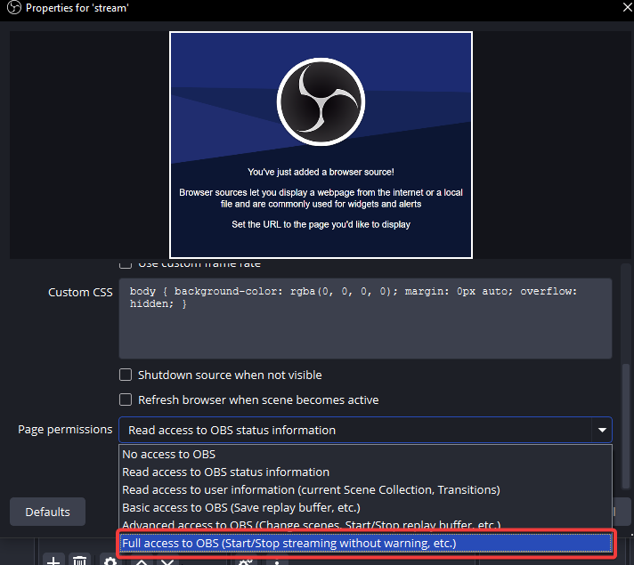

# tiktok live checker

simple api to check which tiktok users are currently live streaming.

## install

```
npm install
npm start
```

runs on port 3000 by default. change with `PORT` environment variable.

## how to use

just get the `/check` endpoint with a list of usernames:

```
/check?users=sodiapu,mc_isti2,vadaszgyula_1
```

### response

you'll get back a plain text response with comma-separated (if multiple) usernames of people who are currently live:

```
sodiapu (sodiapu,sodika)
```

if nobody's live, you'll get an empty response.

## obs integration

use the `/obs` endpoint to automatically control obs when someone goes live:

```
/obs?users=sodiapu,mc_isti2,vadaszgyula_1&mode=stream&reloadInterval=10
```

add this url as a browser source in obs with **"Full access to OBS"** enabled in the browser source properties.



### parameters

- `users` - comma-separated list of usernames to monitor (required)
- `mode` - whether to control streaming or recording (`stream` or `record`, default: `stream`)
- `reloadInterval` - how often (in seconds) to reload the browser source to prevent memory leaks (optional)

### how it works
1. checks every 10 seconds if any users are live
2. when someone goes live, automatically starts streaming/recording
3. when everyone stops streaming, automatically stops streaming/recording
4. if `reloadInterval` is set, the page automatically reloads after that many seconds
